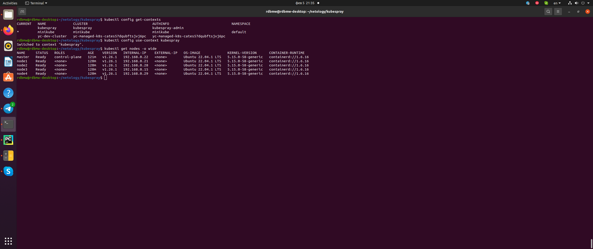

# Домашнее задание к занятию "12.4 Развертывание кластера на собственных серверах, лекция 2"
Новые проекты пошли стабильным потоком. Каждый проект требует себе несколько кластеров: под тесты и продуктив. Делать все руками — не вариант, поэтому стоит автоматизировать подготовку новых кластеров.

## Задание 1: Подготовить инвентарь kubespray

### Вопрос

Новые тестовые кластеры требуют типичных простых настроек. Нужно подготовить инвентарь и проверить его работу. Требования к инвентарю:
* подготовка работы кластера из 5 нод: 1 мастер и 4 рабочие ноды;
* в качестве CRI — containerd;
* запуск etcd производить на мастере.

### Ответ

Клонируем репозиторий kubespray и создаем инвентарь с помощью билдера

```
# Клонирование репозитория
git clone https://github.com/kubernetes-sigs/kubespray

# Установка зависимостей
sudo pip3 install -r requirements.txt

# Копирование примера в папку с вашей конфигурацией
cp -rfp inventory/sample inventory/mycluster

# Обновление Ansible inventory с помощью билдера 
declare -a IPS=(158.160.53.180 158.160.47.191 62.84.114.36 158.160.51.3 158.160.57.106)
CONFIG_FILE=inventory/mycluster/hosts.yaml python3 contrib/inventory_builder/inventory.py ${IPS[@]}
```

В полученный инвентарь [hosts.yaml](src/hosts.yaml) вносим правки (указываем пользователя, определяем мастер-ноду и воркер-ноды и т.д.), добавляем в k8s-cluster.yml параметр ```supplementary_addresses_in_ssl_keys``` с публичным ip мастер-ноды для возможности подключения с локальной машины, запускам плейбук для создания кластера:

```
ansible-playbook -i inventory/mycluster/hosts.yaml cluster.yml -b -v
```

По завершению работы плейбука добавляем кластер в локальный конфиг kubectl, переключаемся на соответствующий контекст и пробуем получить список нод:

